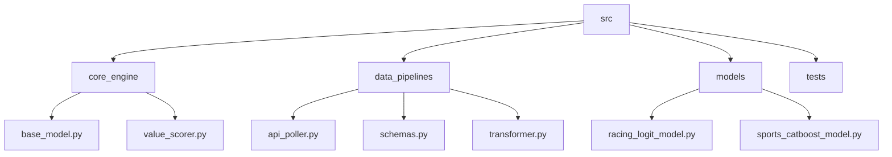
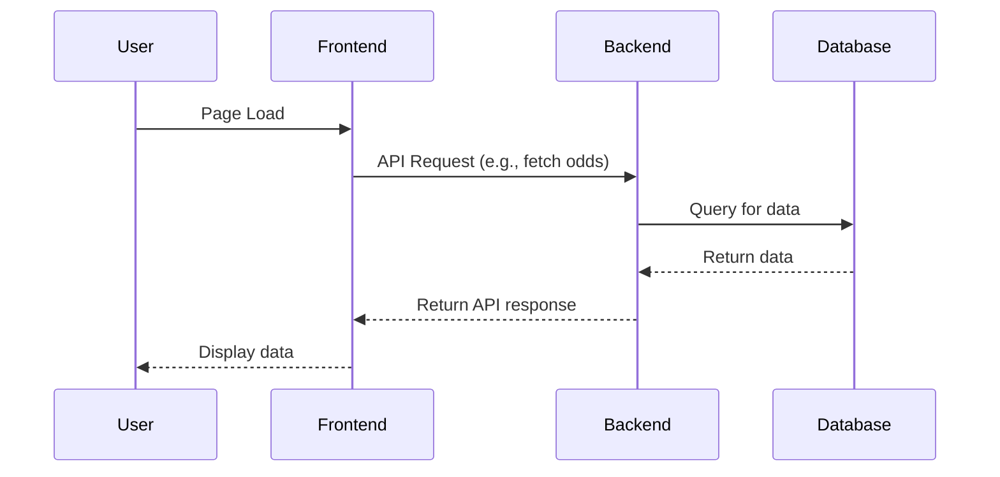

# MultiBet Application: Current Project State

**Last Updated:** 2025-09-17 02:29 UTC

## 1. Program Functionality Outline (JSON)

This JSON object describes the current features and logic of the application. It should be updated by the AI after any significant change.

```json
{
  "version": "0.1.0",
  "description": "Python application structure established with core engine, data pipelines, and ML models for betting analysis.",
  "features": {
    "core_engine": {
      "base_model": "Abstract base class for all MultiBet models",
      "value_scorer": "Calculates value scores and CLV for betting opportunities"
    },
    "data_pipelines": {
      "api_poller": "Fetches data from external betting APIs",
      "schemas": "Pydantic schemas for data validation",
      "transformer": "Data preprocessing and feature engineering"
    },
    "models": {
      "racing_logit_model": "Logistic regression model for horse racing",
      "sports_catboost_model": "CatBoost model for general sports betting"
    }
  }
}
```

## 2. File Structure (Mermaid Diagram)

This diagram shows the current file and directory structure of the application source code.



## 3. System Workflow (Mermaid Diagram)

This diagram illustrates the primary data flow and user interaction logic. For example, how the frontend communicates with the backend.

