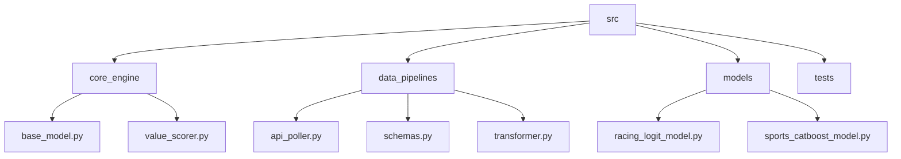

# MultiBet Application: Current Project State
Last Updated: 2025-09-17

## 1. Program Functionality Outline (JSON)
This JSON object describes the initial features and logic for the Minimum Viable Product (MVP). It is the source of truth for the application's intended functionality.

```json
{
  "version": "0.1.0",
  "description": "Architectural baseline for the Unified Multi-Code Bet Generation Engine. Focus on core quantitative logic, a pluggable model interface, and the foundational data pipeline.",
  "features": {
    "core_engine": {
      "description": "The central orchestration layer of the application.",
      "components": [
        {
          "name": "BasePredictiveModel",
          "description": "An abstract base class that defines the contract for all predictive models, ensuring they can be plugged into the engine. Requires 'predict' and 'explain' methods."
        },
        {
          "name": "ValueScoring",
          "description": "Implements the core 'Value_Score' formula as defined in the technical specification."
        }
      ]
    },
    "data_pipeline": {
      "description": "Handles the ingestion and transformation of data from external APIs.",
      "components": [
        {
          "name": "ApiPoller",
          "description": "A service to poll data from 'The Odds API' for market and odds data."
        },
        {
          "name": "DataTransformer",
          "description": "Normalizes raw API data into the 'UnifiedSportsData' and 'UnifiedRacingData' Pydantic schemas."
        }
      ]
    },
    "feature_store": {
        "description": "A two-layer architecture for storing data for online and offline use.",
        "online": "Redis for low-latency access to real-time features for live predictions.",
        "offline": "Google BigQuery for long-term storage, analytics, and model training."
    }
  }
}
```

## 2. File Structure (Mermaid Diagram)

This diagram illustrates the target file structure for the Python application source code within the src/ directory.

