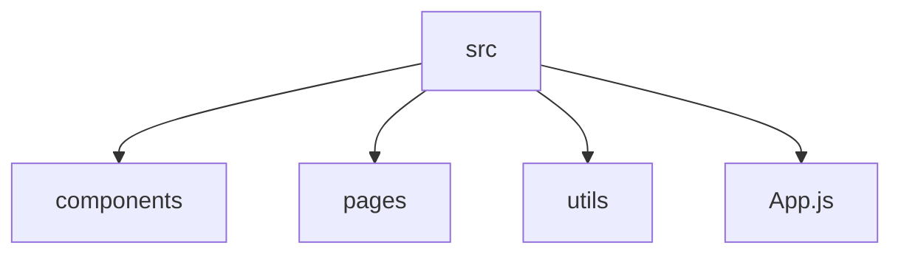

# MultiBet Application: Current Project State

**Last Updated:** 2025-09-17 02:29 UTC

## 1. Program Functionality Outline (JSON)

This JSON object describes the current features and logic of the application. It should be updated by the AI after any significant change.

```json
{
  "version": "0.0.1",
  "description": "Initial project structure setup. No application code yet.",
  "features": {}
}
```

## 2. File Structure (Mermaid Diagram)

This diagram shows the current file and directory structure of the application source code.



## 3. System Workflow (Mermaid Diagram)

This diagram illustrates the primary data flow and user interaction logic. For example, how the frontend communicates with the backend.

