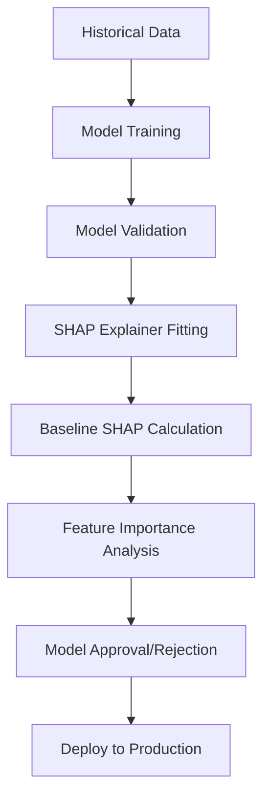
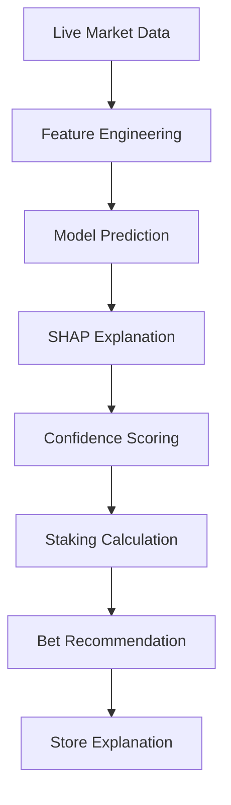
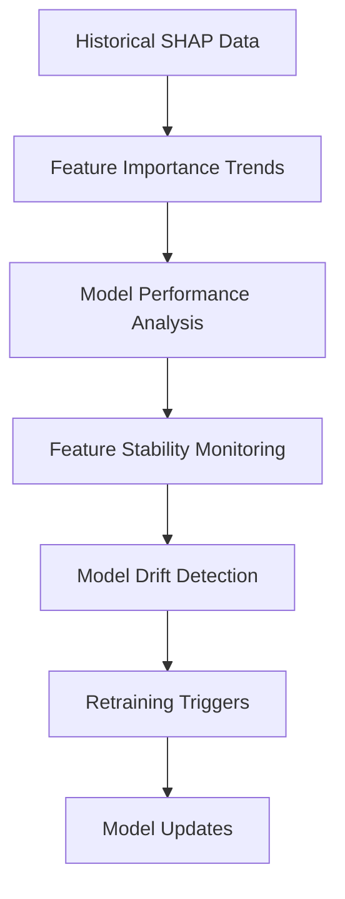

# SHAP Explainability Integration Plan

**Last Reviewed: 2025-09-16**

This document defines how SHAP (SHapley Additive exPlanations) will be integrated into the MultiBet engine's model workflow and how its outputs will be used to enhance model transparency, validation, and confidence scoring.

---

## 1. Integration Points

### 1.1 Model Training Pipeline Integration

**Location:** Within each `BasePredictiveModel` implementation  
**Timing:** Post-training, during model validation phase

```python
class BasePredictiveModel:
    def __init__(self):
        self.shap_explainer = None
        self.baseline_shap_values = None
    
    def fit_explainer(self, training_data):
        """Initialize SHAP explainer after model training"""
        # Implementation varies by model type
        pass
    
    def calculate_baseline_importance(self, validation_set):
        """Calculate baseline feature importance on validation set"""
        pass
```

**Integration Points by Model Type:**

- **RacingConditionalLogitModel:** SHAP TreeExplainer for logistic regression components
- **SportsCatBoostClassifier:** SHAP TreeExplainer (native CatBoost support)
- **PlayerTriesNBModel:** SHAP KernelExplainer for generalized linear models
- **PlayerDisposalsLSTMModel:** SHAP DeepExplainer for neural networks

### 1.2 Real-Time Prediction Pipeline Integration

**Location:** Within the `CoreEngine` prediction orchestration  
**Timing:** Immediately after model prediction, before staking calculation

```python
class CoreEngine:
    def generate_prediction_with_explanation(self, input_data):
        """Generate prediction with SHAP explanation"""
        prediction = self.model.predict(input_data)
        shap_values = self.model.explain_prediction(input_data)
        confidence_score = self.calculate_confidence_from_shap(shap_values)
        
        return {
            'prediction': prediction,
            'shap_values': shap_values,
            'confidence_score': confidence_score
        }
```

### 1.3 Feature Store Integration

**Online Store (Redis):** Cache pre-computed SHAP baseline values for real-time confidence scoring  
**Offline Store (BigQuery):** Store detailed SHAP explanations for historical analysis and model monitoring

---

## 2. Output Visualization

### 2.1 Summary Plots

**Feature Importance Overview:**
- **Global Feature Importance:** Aggregated SHAP values across all predictions to identify most influential features
- **Feature Importance by Market Type:** Separate analysis for racing vs. sports vs. player props
- **Temporal Feature Importance:** Track how feature importance changes over time

**Implementation:**
```python
import shap
import matplotlib.pyplot as plt

def generate_summary_plot(shap_values, feature_names, market_type):
    """Generate SHAP summary plot for feature importance analysis"""
    shap.summary_plot(shap_values, feature_names, 
                     title=f"Feature Importance - {market_type}")
    plt.savefig(f"shap_summary_{market_type}.png")
```

### 2.2 Force Plots

**Individual Prediction Explanations:**
- **Real-time Force Plots:** For each bet recommendation, show how each feature contributes to the final prediction
- **Interactive Web Interface:** Allow users to explore individual bet explanations
- **Comparative Analysis:** Side-by-side force plots for similar events to identify prediction differences

**Implementation:**
```python
def generate_force_plot(base_value, shap_values, feature_values, feature_names):
    """Generate SHAP force plot for individual prediction"""
    return shap.force_plot(base_value, shap_values, feature_values, 
                          feature_names, show=False, matplotlib=True)
```

### 2.3 Waterfall Plots

**Detailed Feature Contribution:**
- **Step-by-step breakdown** of how each feature moves the prediction from baseline
- **Threshold Analysis:** Highlight features that push predictions above/below betting thresholds
- **Model Debugging:** Identify unexpected feature contributions for model validation

### 2.4 Dependence Plots

**Feature Interaction Analysis:**
- **Partial Dependence:** Show how individual features affect predictions across their value range
- **Feature Interactions:** Identify and visualize interactions between key features
- **Market Condition Analysis:** Show how feature importance varies with market conditions

---

## 3. Interpretation Strategy

### 3.1 Individual Prediction Explanations

**Bet Recommendation Context:**
Each bet recommendation will include:

```python
class BetRecommendation:
    def __init__(self):
        self.prediction_probability = None
        self.value_score = None
        self.recommended_stake = None
        self.explanation = {
            'confidence_score': None,      # Derived from SHAP
            'top_positive_features': [],   # Features supporting the bet
            'top_negative_features': [],   # Features against the bet
            'baseline_deviation': None,    # How far from model baseline
            'feature_stability': None      # Consistency of feature importance
        }
```

**User-Facing Explanations:**
- **Simple Language:** "This bet is recommended primarily because [top feature] shows [direction] which historically indicates [outcome]"
- **Confidence Indicators:** Visual indicators showing prediction confidence based on SHAP value distribution
- **Risk Warnings:** Flag predictions that rely heavily on features with high uncertainty

### 3.2 Overall Feature Importance Analysis

**Model Performance Insights:**
- **Feature Ranking:** Maintain running rankings of most important features across all models
- **Feature Stability Monitoring:** Track how feature importance changes over time
- **Cross-Model Validation:** Compare feature importance across different model types for consistency

**Business Intelligence:**
- **Market Insights:** Identify which factors drive value in different markets
- **Data Quality Monitoring:** Detect when important features have data quality issues
- **Feature Engineering Guidance:** Identify opportunities for new feature development

### 3.3 Model Confidence Scoring

**SHAP-Based Confidence Score:**

```python
def calculate_confidence_from_shap(shap_values, baseline_values):
    """
    Calculate model confidence score based on SHAP value characteristics
    
    Factors considered:
    - Magnitude of SHAP values (stronger signal = higher confidence)
    - Consistency with historical patterns
    - Feature agreement (all features pointing same direction)
    - Baseline deviation (farther from baseline = more confident)
    """
    
    # Normalize SHAP values
    shap_magnitude = np.abs(shap_values).sum()
    
    # Calculate feature agreement
    positive_features = (shap_values > 0).sum()
    negative_features = (shap_values < 0).sum()
    feature_agreement = abs(positive_features - negative_features) / len(shap_values)
    
    # Compare to baseline distribution
    baseline_deviation = abs(shap_values.sum() - baseline_values.mean())
    
    # Combine factors into confidence score (0-1)
    confidence_score = min(1.0, (shap_magnitude * feature_agreement * baseline_deviation) / threshold)
    
    return confidence_score
```

---

## 4. End-to-End Workflow

### 4.1 Model Training Phase



**Steps:**
1. **Train Model:** Standard model training on historical data
2. **Fit SHAP Explainer:** Initialize appropriate SHAP explainer for model type
3. **Calculate Baseline:** Generate SHAP values on validation set for baseline metrics
4. **Validate Explanations:** Ensure SHAP explanations align with domain knowledge
5. **Store Explainer:** Persist SHAP explainer alongside trained model

### 4.2 Real-Time Prediction Phase



**Steps:**
1. **Receive Market Data:** New betting market or odds update
2. **Generate Features:** Extract features using data pipeline
3. **Make Prediction:** Generate probability prediction using trained model
4. **Calculate SHAP Values:** Explain prediction using fitted SHAP explainer
5. **Score Confidence:** Calculate confidence score from SHAP characteristics
6. **Determine Stake:** Use confidence score in Dynamic Fractional Kelly staking
7. **Generate Recommendation:** Create bet recommendation with explanation
8. **Store Results:** Save explanation data for monitoring and analysis

### 4.3 Analysis and Monitoring Phase



**Continuous Monitoring:**
- **Daily Feature Importance Reports:** Track changes in feature rankings
- **Weekly Model Explanation Audits:** Review explanations for outlier predictions
- **Monthly Feature Stability Analysis:** Identify features with changing importance
- **Quarterly Model Transparency Reviews:** Comprehensive analysis of all explanations

### 4.4 Integration with Dynamic Staking

The confidence score derived from SHAP analysis directly feeds into the Dynamic Fractional Kelly staking:

```python
def calculate_dynamic_stake(base_kelly_fraction, confidence_score, model_probability, odds):
    """
    Integrate SHAP-based confidence into staking calculation
    """
    # SHAP confidence becomes the MCS (Model Confidence Score)
    dynamic_kelly_fraction = base_kelly_fraction * confidence_score
    
    # Apply to standard Kelly formula
    stake = bankroll * dynamic_kelly_fraction * ((odds * model_probability) - 1) / (odds - 1)
    
    return min(stake, max_stake_cap * bankroll)
```

---

## 5. Implementation Timeline

### Phase 1: Foundation (Weeks 1-2)
- Implement `BasePredictiveModel` SHAP interface
- Create SHAP explainer factory for different model types
- Develop confidence scoring algorithm

### Phase 2: Model Integration (Weeks 3-4)
- Integrate SHAP into each model class
- Implement real-time explanation generation
- Add explanation storage to Feature Store

### Phase 3: Visualization & Analysis (Weeks 5-6)
- Build SHAP visualization pipeline
- Create monitoring dashboards
- Implement automated reporting

### Phase 4: Production Integration (Weeks 7-8)
- Integrate confidence scoring into staking engine
- Add explanation data to bet recommendations
- Deploy monitoring and alerting systems

---

## 6. Success Metrics

### 6.1 Technical Metrics
- **Explanation Latency:** < 50ms for real-time predictions
- **Feature Importance Stability:** < 10% variance in top features week-over-week
- **Confidence Score Calibration:** Strong correlation between confidence and actual accuracy

### 6.2 Business Metrics
- **Model Transparency:** Ability to explain 100% of bet recommendations
- **Stakeholder Trust:** Reduced model "black box" concerns
- **Performance Improvement:** 15% improvement in Dynamic Kelly effectiveness through better confidence scoring

### 6.3 Operational Metrics
- **Monitoring Coverage:** SHAP analysis for 100% of production predictions
- **Alert Accuracy:** < 5% false positive rate for model drift detection
- **Explanation Quality:** Domain expert validation of explanation accuracy

---

This explainability plan ensures that SHAP integration enhances both the technical robustness and business value of the MultiBet engine while maintaining the high-performance, real-time requirements of the betting environment.